# Колода

### 42 демотиватора

Текущая колода состоит из 42 карт, описывающих приближение к неусточивому состоянию отказа от собственного дела.  

В **корпоративной версии**" игры количество используемых колод равно числу игроков.

В полном варианте колоды не смешиваются и каждая тасуется отдельно. В коротком, "пьяном" варианте игры, колоды можно смешать. 

# Карточки

### Карточки

Во время раздачи каждый играющий строит игровое поле из 20 случайных карт личной колоды. Ведущий за один ход выбрасывает один номер из 42, а игрок решает, стало ли это причиной бросить и не продолжать собственный проект. Игра заканчивается как только один из игроков соберет **пять демотиваторов в одну горизонтальную линию**. 

Подробнее о раздаче в ["**Правилах игры**"](/rules/). 

| ------------ | ------------ | ------------ |
 <a href="/ComfortLimitReached/">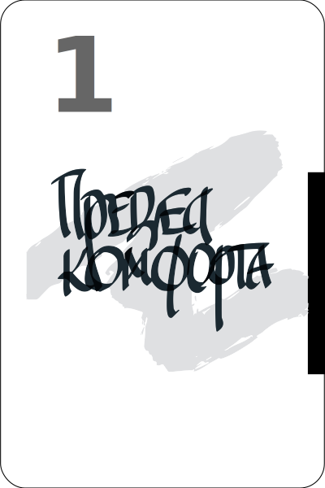</a> | <a href="/UnmaskingTheImpostor/">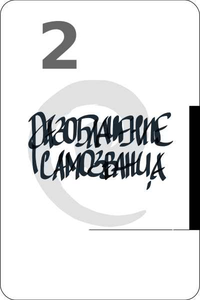</a> | <a href="/ComfortLimitReached/">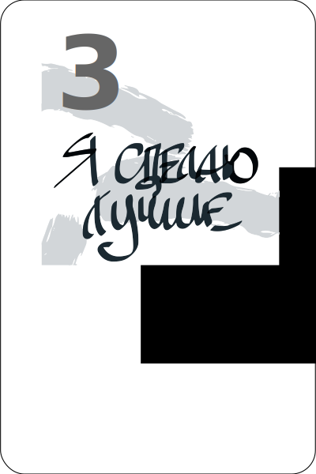</a> | 
| <a href="/UnmaskingTheImpostor/">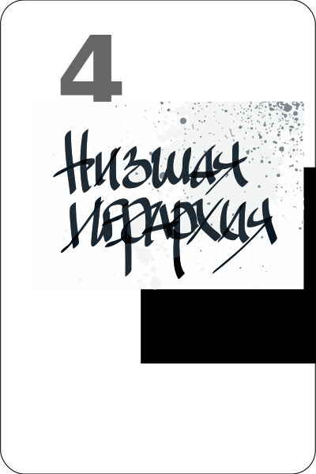</a> |  | <a href="/UnmaskingTheImpostor/">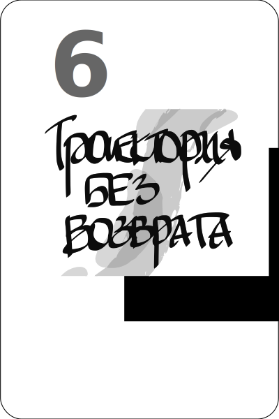</a> |
| <a href="/ComfortLimitReached/">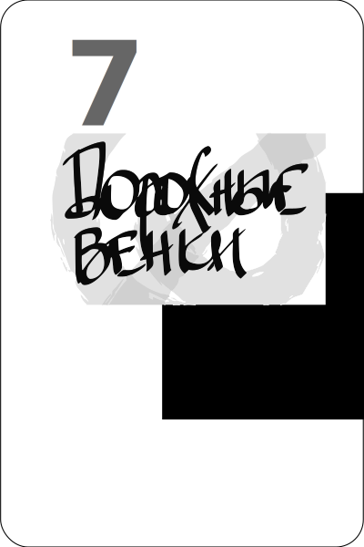</a> | <a href="/UnmaskingTheImpostor/">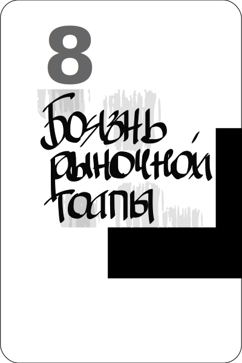</a> | <a href="/ComfortLimitReached/">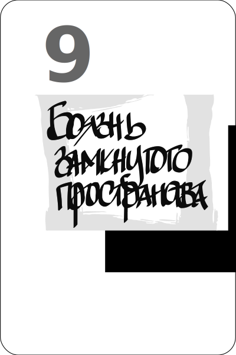</a> | 
| <a href="/UnmaskingTheImpostor/">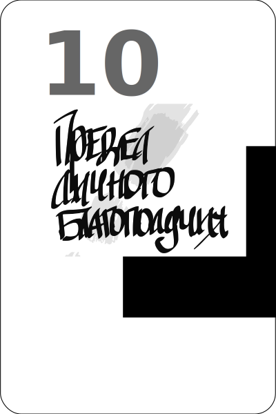</a> | <a href="/ComfortLimitReached/">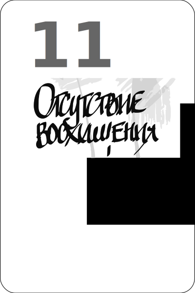</a> | <a href="/UnmaskingTheImpostor/">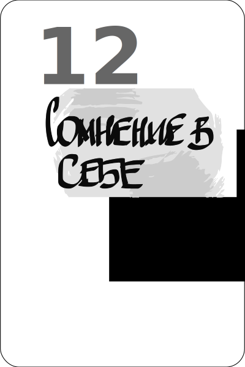</a> |
| <a href="/ComfortLimitReached/">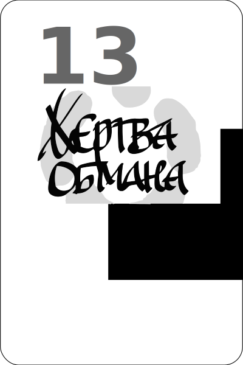</a> |  | <a href="/ComfortLimitReached/">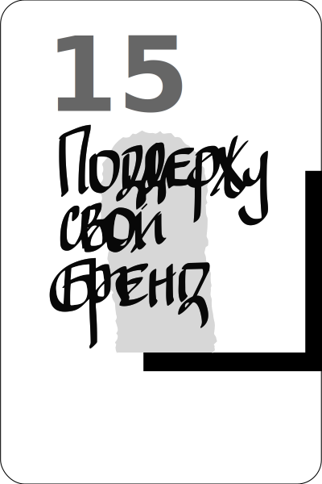</a> | 
|  | <a href="/ComfortLimitReached/">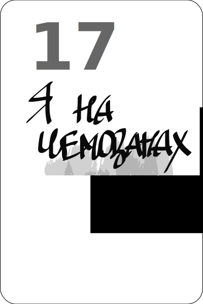</a> |  |
| <a href="/ComfortLimitReached/">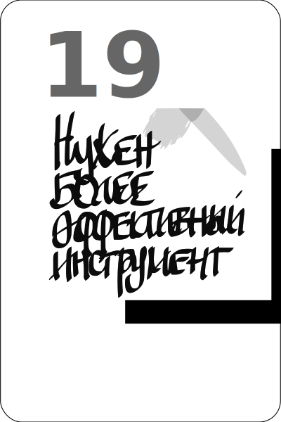</a> |  |  | 
|  | <a href="/ComfortLimitReached/">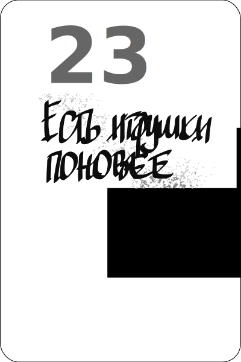</a> | <a href="/UnmaskingTheImpostor/">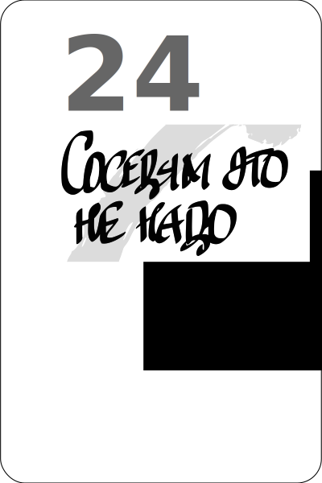</a> |
|  | <a href="/UnmaskingTheImpostor/">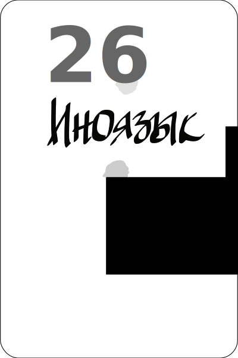</a> |  | 
|  | <a href="/ComfortLimitReached/">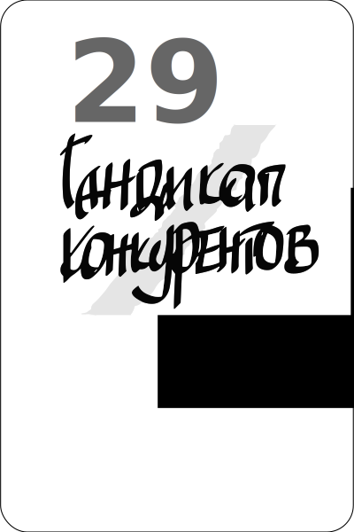</a> | <a href="/UnmaskingTheImpostor/">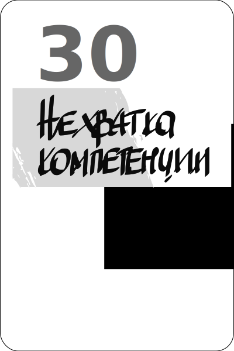</a> |
| <a href="/ComfortLimitReached/">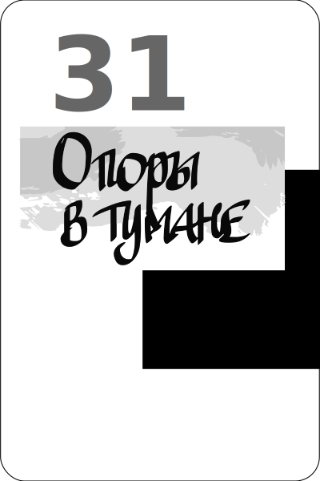</a> | <a href="/UnmaskingTheImpostor/">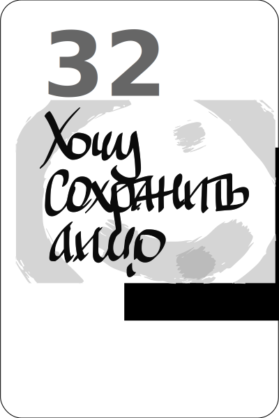</a> |  | 
| <a href="/UnmaskingTheImpostor/">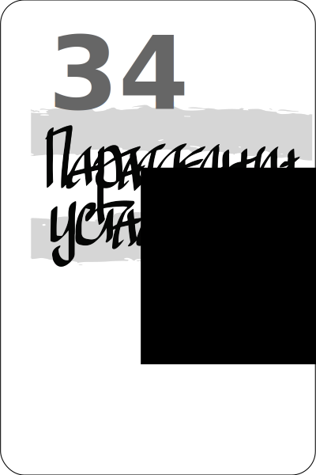</a> |  |  | 
|  |  |  | 
|  | <a href="/ComfortLimitReached/">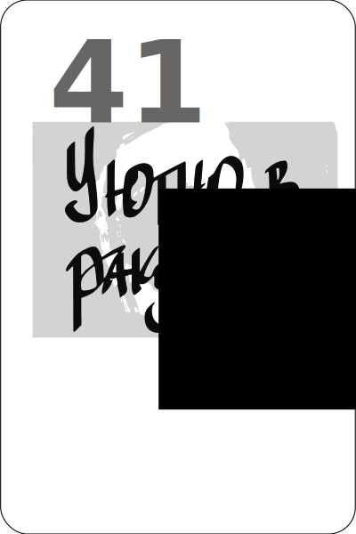</a> |  |

# Текстовое описание карт
| ---- | ---- |
| ### 1 ["Граница комфорта"](/ComfortLimitReached/)
Переход в новое дело связан с потерей достигнутого комфорта. Чем-то напоминает затянувшийся микс падения в лифте, воздушных ям и первых мгновений осмотра стоматологом. | ### 2 ["Беглый самозванец"](/UnmaskingTheImpostor/)
Страх разоблачения, которое невозможно опровергнуть. |

### 3 ["Я сделаю лучше"](/IDoBetter/)
Страх дискомфорта в пограничном состоянии неизбежного делегирования и управления качеством при переходе к масштабированию проекта.
### 4 ["Я слишком низко в иерархии"](/Hierarchy/)
Растерянность от того, что детали и тонкости дела которым начал заниматься не логичные, зависят от контекста. Но кому-то они доступны в силу должности или по праву рождения. Просто так, без особого труда.
### 5 ["У меня есть обязательства"](/Obligation/)
Смесь стыда перед теми кто доверяет и страха от надвигающейся катастрофы для тех с кем работаешь.
### 6 ["Траектория без возврата"](/WithoutReturn/)
Ощущение невозможности вернуться к исходной точки с которой начал ежедневное движение. 
### 7 ["Дорожные венки"](/WreathsOnPillars/)
Уныние, потеря интереса по мере того, как становится понятно, что многие бросили проекты в этой области и не получили ничего, кроме разочарования и убытков.
### 8 ["Страх открытого мира"](/Agoraphobia/)                                                                                    
Страх переходящий в физическое отвращение от мысли, что развивая проект придется **от своего имени** общаться с большим количеством люд
ей, куда-то ходить, ездить, летать, что-то рассказывать незнакомым людям.
### 9 ["Западня"](/Claustrophobia/)
Пространство вокруг стремительно сокращается и это связано с тем, что меня перестают понимать.
### 10 [Процветание](/Prosperity/)
Постоянная **вовлечённость в карнавал других людей**. Жизнь настолько полная, приятная, налаженная и полна
 доступных соблазнов, что проект каждый раз отодвигается "на потом", ведь жизнь бесконечна.

### 11 ["Нет восхищения"](/NoApplause/)                                                                                               
Растерянность от того, что эффект от демонстрации миру проекта не несет в себе восторга и аплодисментов.
### 12 ["Утерянный профессионализм"](/DoubtAboutProfessionalism/)                                                                      
Саморефлексия на фоне других специалистов, перешедшая в самоуничижение.
### 13 ["Меня обманули"](/Hype/)                                                                                                       
Ощущение себя как жертвы обмана, в котором участвовали все, кому доверял в момент отказа. Они точно убеждали меня "бросить свои фантази
и" и делать какую-то полную пустышку.

### 14 ["Прервусь на минутку"](/Intermit/)

**Постоянно надо** было отвлекаться на какие-то мелочи и с каждым разом втягиваться в дело было всё **сложнее и сложнее**.

### 15 ["Поддержу свой бренд"](/SupportMyBrand/)                                                                                      
Сожаление о том, что приходится бросать область в которой получил свой авторитет.
### 16 ["Стар я для этого дерьма"](/ChairDays/)                                                                                       
Дискомфорт от физического сравнения себя с другими. Пока я раскручивался идея проекта стала мэйн-стримом, в неё влилось множество специ
алистов намного моложе, а главное энергичнее.
### 17 ["Ожидание на чемодане"](/WaitingForAnInvite/)                                                                                 
Временность проекта, в любой момент готовность  остановить, бросить или отложить.
### 18 ["Деньги нужны для другого"](/NotAPriority/)                                                                                    
Потребность постоянно понижать ресурсный приоритет дела которым занимаешься.
### 19 ["Нужен более эффективный инструмент"](/OtherTool/)                                                                             
Раздражение от инструментов которыми пользуешься
### 20 ["Кто-то должен меня обслуживать"](/NeedAServant/)                                                                              
Дискомфорт от неустроенности 
### 21 ["Кругом враги"](/EnemiesAllAround/)                                                                                            
Ощущение постоянного наблюдения и злонамеренного вмешательства
### 22 ["Отсоветовали дилетанты"](/AmateurTips/)                                                                                       
Злость на собственную доверчивость
### 23 ["Есть игрушки поновее"](/NewToys/)                                                                                             
Пустота, обида на себя
### 24 ["Соседям это не надо"](/NoLocalMarket/)                                                                                        
Не понимание того, как кому-то, что-то можно продать
### 25 ["Что-то не так с головой"](/ImaginaryDementia/)                                                                         
Недоумение о того, что какие-то детали не запоминаются или остаются вне понимания
### 26 ["Иноязык"](/AnotherLanguage/)                                                                                                 
Ощущение сумбура и шума вместо общения
### 27 ["Безнадежно отстал"](/BehindInTheRace/)                                                                                       
Ощущение того, что самый последний в этой гонкеi
### 28 ["Уродство сравнения"](/OthersHaveItBetter/)                                                                                    
Стыд, смущение и разочарование проделанной работой и её результатом
### 29 ["Гандикап конкурентов"](/Handicap)                                                                                      
Обида на судьбу и уверенность в том, что конкуренты на старте получили не заслуженное преимущество
### 30 ["Дефицит компетенции"](/CompetenceDeficit/)                                                                                    
Растерянность перед слишком широкими рамками проекта
### 31 ["Опоры в тумане"](/OutOfFocus/)                                                                                                
Спутанность в выборе дальнейшего шага
### 32 ["Хочу сохранить лицо"](/DontLoseFace/)                                                                                        
Двойная жизнь с опасением потерять авторитет
### 33 ["Цейтнот экспертизы"](/DidNotHaveEnoughTime/)                                                                                  
Сожаление о том, что не уделил времени и внимания
### 34 ["Параллельная усталость"](/CumulativeFatigue/)                                                                                 
Непреодолимое желание заменить не оплачиваемую работу отдыхом
### 35 ["Дежавю эксперта"](/EverythingWas/)                                                                                            
Ощущение того, что это всё уже было, закончилось и никому не понадобиться
### 36 ["Оракул из лампы"](/UninvitedExpert/)                                                                                          
Досада от того, что купился на проходные размышления незнакомого человека счтиющегося специалистом во всём
### 37 ["Зима близко"](/SignsOfTrouble/)                                                                                               
Ожидание системных запретов или ограничений от государственной системы
### 38 ["Гринвич далеко"](/OffTheField/)                                                                                               
Пустота коммуникаций из-за сложившихся национальных обстоятельств
### 39 ["Акулы в ванной"](/ImaginaryHazards/)                                                                                          
Мания преувеличения угрожающей опасности
### 40 ["Печальное масштабирование цели"](/ExchangeOfNothingForNothing/)                                                               
Осознание несоразмерности затрат полученному удовлетворению
### 41 ["Уютно в ракушке"](/SnailHouse/)                                                                                              
Удовольствие от медленного ритма работы, дискомфорт от любого "ускорения"
### 42 ["Нет опоры"](/Limbo/)                                                                                                          
Ощущение падения в бесконечную пропасть

 
